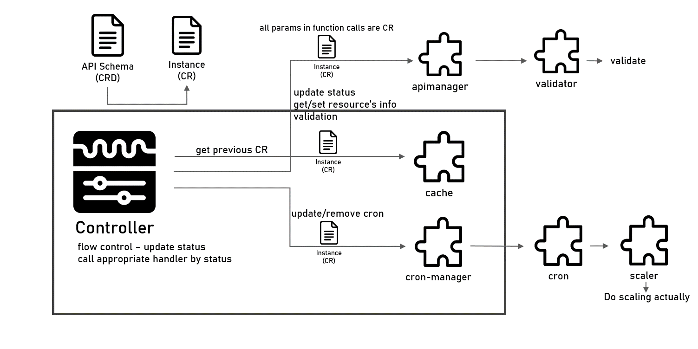

# Architecture

## Overall Architecture

## Contents
- [Architecture](#architecture)
  - [Overall Architecture](#overall-architecture)
  - [Contents](#contents)
  - [API](#api)
  - [Controller](#controller)
  - [Packages](#packages)
    - [ApiManager](#apimanager)
    - [Cache](#cache)
    - [CronManager](#cronmanager)
    - [Scaler](#scaler)
    - [Validator](#validator)
  - [Internal](#internal)

## API
In API, `schema` of `declarative api`, CustomResourceDefinition, is defined. All components must communicate with this `schema`. It means all parameters in function calls between each component **must** be **the instance of this schema**.

## Controller
`Controller(Reconciler)` is handle reconcile logic. `Reconcile function` is called all events(create, update, patch, delete, etc) on each single `Custom Resource`(Scheduled Scaler), include patching status. Therefore, Controller should recognize **which event is happen** on currently reconciling object, **what the status of object is** and **call method of an appropriate handler**. In short, Controller **only** control **the flow of reconciling**.

## Packages
Each `components`(handlers and managers) called by `controller` or `other components` is packed in `pkg` directory. The information of components is below

### ApiManager
`apimanager` has helper functions to *get/set* informations from/to custom resource, and *validation api*.

### Cache
`cache` stores *previous custom resource instance* to compare to currently reconciling resource. `Controller` figures out the status of custom resource with this `cache`

### CronManager
`ScheduledScaler` schedules scaling with `cron`. Each ScheduledScaler create cron based on `spec.schedule`. CronManager manage crons with map, and handle *CRUD* of each cron.

### Scaler
`Scaler` do scaling **actually**. There're two scaler implementation: `range`, `fixed`.

### Validator
`Validator` validates spec of Custom Resource. It called by ApiManager to serve backend validation service.

## Internal
In `internal` directory, there're `util` and `k8s` package. `util` just has utility functions, and `k8s` has helper functions to CRUD `k8s resource`.